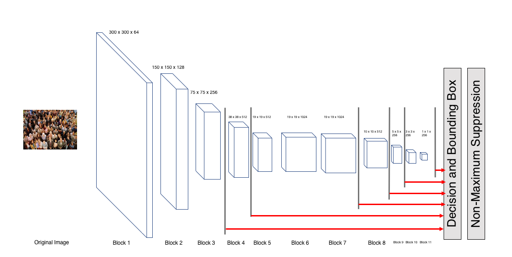
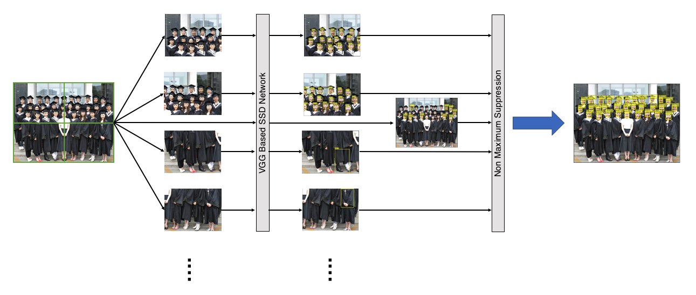
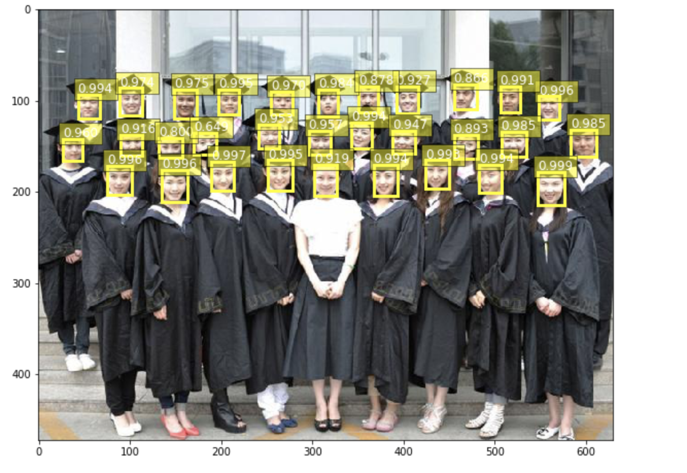
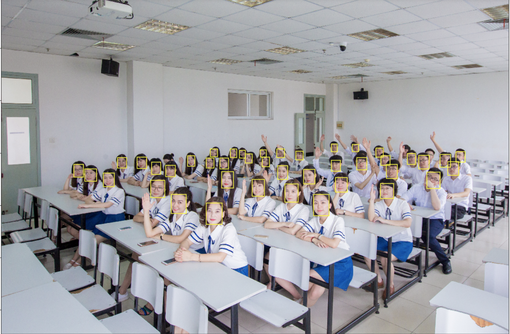

## Author:
Yu Zhong yuz871@eng.ucsd.edu<br>
Shiming Luo shl666@ucsd.edu

## Requirement:
Python 3.6<br>
Tensorflow <br>
<br>
download (original SSD300 network check point)[https://drive.google.com/a/eng.ucsd.edu/file/d/1znGTqsAa0M9gN1EDCqP9Pw667kjAsgwj/view?usp=sharing] <br>
download (SSD300 added block3 check point)[https://drive.google.com/a/eng.ucsd.edu/file/d/12NkA9rBi_4_x32Vbcbftc1SUxXPcO4Ut/view?usp=sharing]<br>
## Introduction:
This is a SSD300 based small object detection model. We add the **3rd block** of the orignal SSD model and apply the method called **Cropping Prediction**.<br>
<br>
The architecture of modified SSD300 model:<br>

<br>
The flow chart of **Cropping Prediction**.<br>


## SSD demo

The [SSD Notebook](notebooks/ssd_notebook.ipynb) contains a demo of our work.

Here are two examples of successful detection outputs:



To run the notebook you first have to unzip the checkpoint files in ./checkpoint
```bash
unzip original_model.zip
unzip add_block3.zip
```
and then start a jupyter notebook with
```bash
jupyter notebook notebooks/ssd_notebook.ipynb
```


## Datasets

VOC 2007 <br>
VOC 2012 <br>
WIDER FACE <br>
The way to convert **VOC 2007** and **VOC 2012** plz see  [balancap/SSD-Tensorflow](https://github.com/balancap/SSD-Tensorflow)

The way to convert **WIDER FACE** plz see [yeephycho/widerface-to-tfrecord](https://github.com/yeephycho/widerface-to-tfrecord)<br>


## Training

The script `train_ssd_network.py` is in charged of training the network.<br>

For instance, one can fine a model starting from the former as following:
```bash
DATASET_DIR=./tfrecords/WF/train
TRAIN_DIR=./log/WF_original
python train_ssd_network.py \
    --train_dir=${TRAIN_DIR} \
    --dataset_dir=${DATASET_DIR} \
    --dataset_name=WiderFace \
    --dataset_split_name=train \
    --model_name=ssd_300_vgg \
    --num_classes=2 \
    --save_summaries_secs=60 \
    --save_interval_secs=600 \
    --weight_decay=0.0005 \
    --optimizer=adam \
    --learning_rate=0.001 \
    --learning_rate_decay_factor=0.94 \
    --batch_size=32
```


A number of pre-trained weights of popular deep architectures can be found on [TF-Slim models page](https://github.com/tensorflow/models/tree/master/slim).

## Credit
Inspired by:<br>
-[kuangliu/pytorch-ssd](https://github.com/kuangliu/pytorch-ssd)<br>
-[yeephycho/widerface-to-tfrecord](https://github.com/yeephycho/widerface-to-tfrecord)<br>
-[balancap/SSD-Tensorflow](https://github.com/balancap/SSD-Tensorflow)

